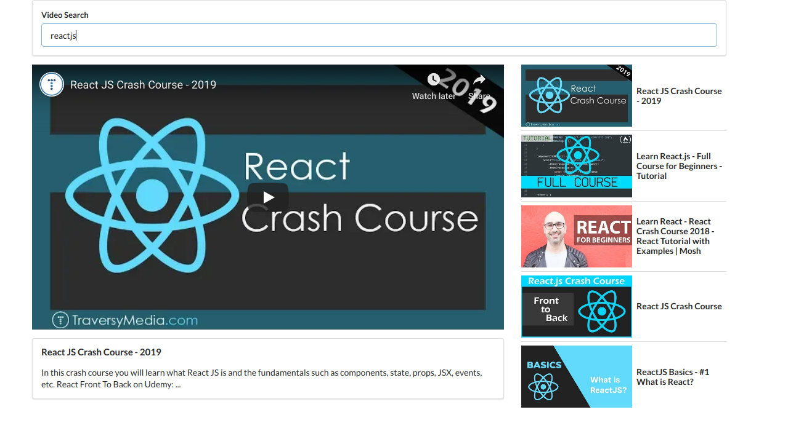

This app uses youtube api and uses the first 10 videos and displays them on the side.  The first video defaults in the iframe.  

'yarn install' will get the necessary node_modules.

'yarn start' will load to localhost 3000.
